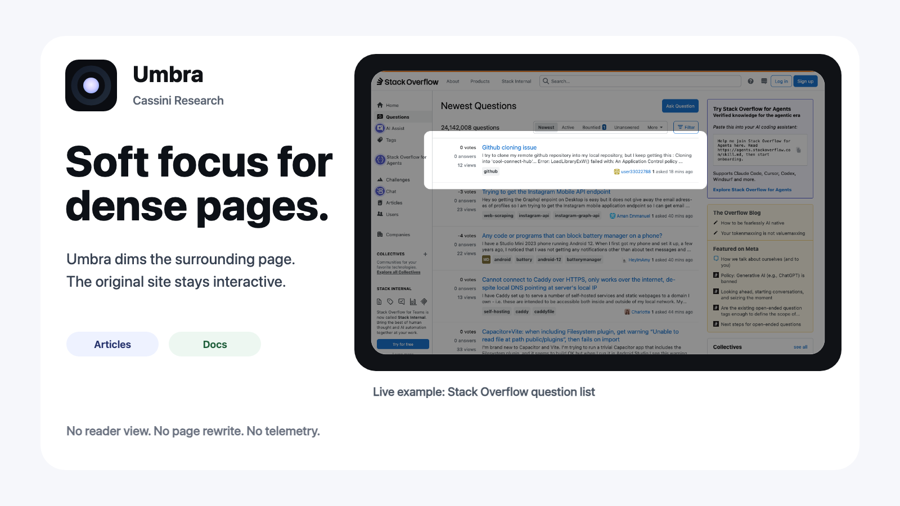

# Umbra Launch Kit

Umbra is ready to present as a Cassini Research product. This folder contains the public launch copy, real-site screenshots, and brand assets for Chrome Web Store submission, blog publication, and social posts.

## Assets



- Logo mark: `assets/logo/umbra-mark.svg` and `assets/logo/umbra-mark.png`
- Wordmark: `assets/logo/umbra-logo.svg` and `assets/logo/umbra-logo.png`
- Launch poster: `assets/poster/umbra-launch-poster.svg` and `assets/poster/umbra-launch-poster.png`
- Store promo tile: `assets/poster/umbra-store-promo-440x280.svg` and `assets/poster/umbra-store-promo-440x280.png`
- Real-site screenshots: `assets/screenshots/`

## Docs

1. `docs/01-positioning-and-research.md`
2. `docs/02-use-cases-and-screenshots.md`
3. `docs/03-go-live-checklist.md`
4. `docs/04-blog-and-social.md`

## Release Gate

Run from the repo root:

```bash
npm run lint
npm test
npm run test:e2e
npm run validate
npm run package:extension
```

Upload `dist/umbra-2.2.2.zip` after the checks pass.
