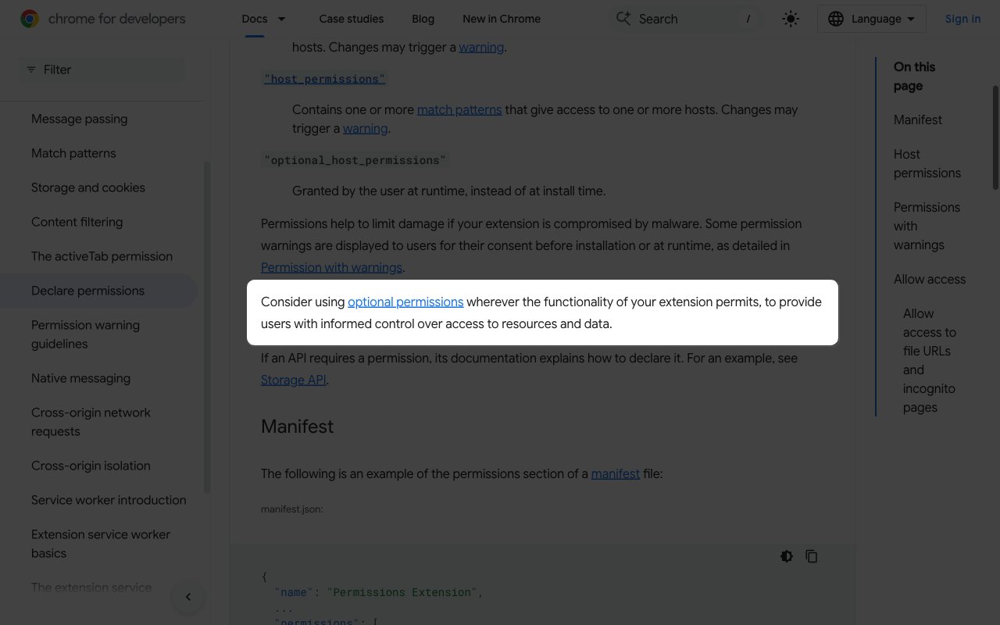
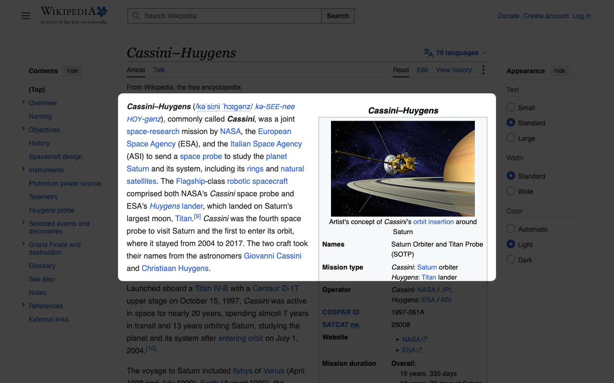
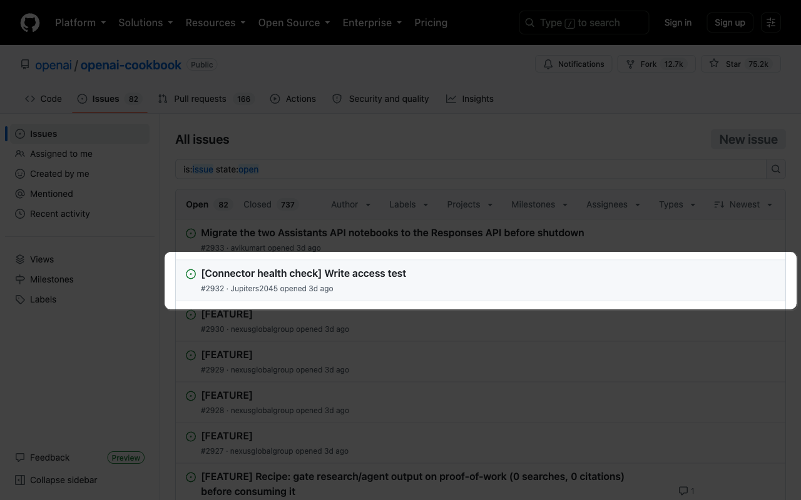
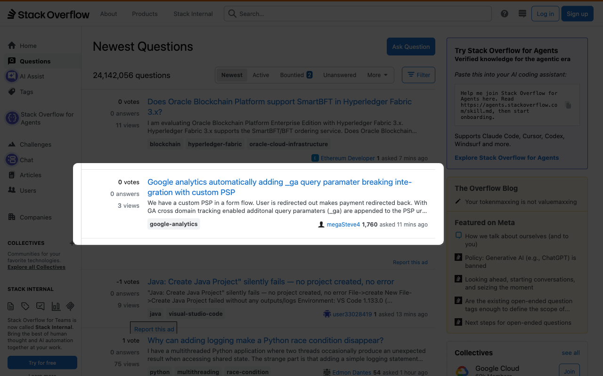

# 02 - Use Cases and Screenshots

These screenshots were captured on public websites with the local extension loaded. They are not product mockups or fixture pages.

## Technical documentation

[Chrome Developers permissions documentation](https://developer.chrome.com/docs/extensions/develop/concepts/declare-permissions) combines article text, two navigation systems, code terms, and page controls. Umbra keeps the current documentation block clear without removing those references.

## Reference article

The [Cassini-Huygens article on Wikipedia](https://en.wikipedia.org/wiki/Cassini%E2%80%93Huygens) has a contents rail, an infobox, article tools, and long text. Umbra leaves that context available while separating the current section.

## Issue triage

The [OpenAI Cookbook issue list](https://github.com/openai/openai-cookbook/issues) contains repository navigation, filters, labels, counts, and repeated issue rows. This is a useful test of whether one row can win over the surrounding repository shell.

## Question list

[Stack Overflow Questions](https://stackoverflow.com/questions) combines search, filters, tags, side navigation, a right rail, and repeated summaries. The selected question should remain distinct without blocking nearby controls.

## Use in public material

Use screenshots that show the selected block and enough surrounding page to prove the difference. Do not crop away all of the noise. Recheck third-party branding and content before paid or long-running campaigns.
